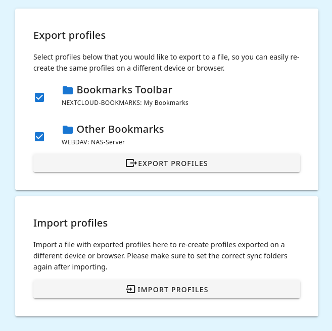

In order to sync bookmarks between multiple browsers with floccus you need to set up the same profile on each browser that you want to sync. You can do this manually, but this can get tedious. In order to ease the setup process you can export all profiles that you've set up on one browser as a JSON file and import this file on all the other browsers to quickly recreate the same profiles there.

After importing new profiles you may have to manually re-set the folder to sync in the profile settings, all other profile settings should be overtaken.
Make sure to treat the exported JSON file with utmost security, as it contains the access tokens and passwords for the servers you configured.

Do not confuse this feature with bookmarks sync. Floccus syncs your booknmarks automatically, no manual import or export needed, this is only for profiles to ease the process of setting up floccus on all your devices.
