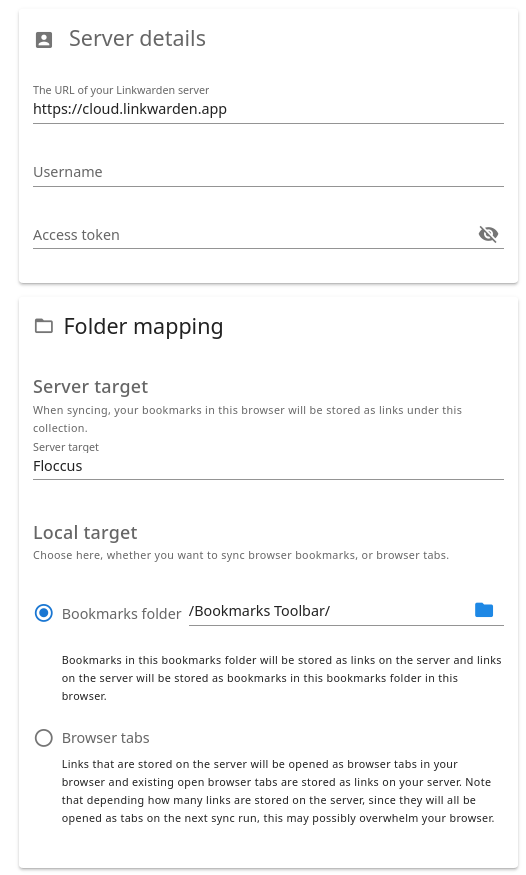

1. Create a new profile in the Floccus panel
2. Select Linkwarden as your sync method
3. Optionally set a name for your new profile.
4. The following screen shows the connection settings.
4. First you will need to enter your Linkwarden URL. This should be the root URL of your Linkwarden server, e.g. https://cloud.linkwarden.app/ for the publicly hosted instance by the linkwarden devs. The URL should end with a slash.
5. Then enter your username and an access token. Entering your account password will not work, instead you have to generate a specific access token in the linkwarden settings for floccus.
6. Enter the name of a collection to sync to. All your bookmarks as well as any folders you have will be created under this collection.
7. Finally, you can choose which bookmarks folder to sync to that collection. By default floccus will create a new folder for you, to avoid syncing something that you don’t want synced. However, with a click on the folder icon you can select any other folder in your bookmarks. It is not advised anymore to select the topmost folder, because the built-in bookmarks folders are named differently depending on browser vendor and language, and the original attempt to bridge this gap is no longer possible.
8. Make sure to disable your native browser bookmark sync service, because it is likely incompatible with floccus. (This can cause frequent duplication of bookmarks.)
