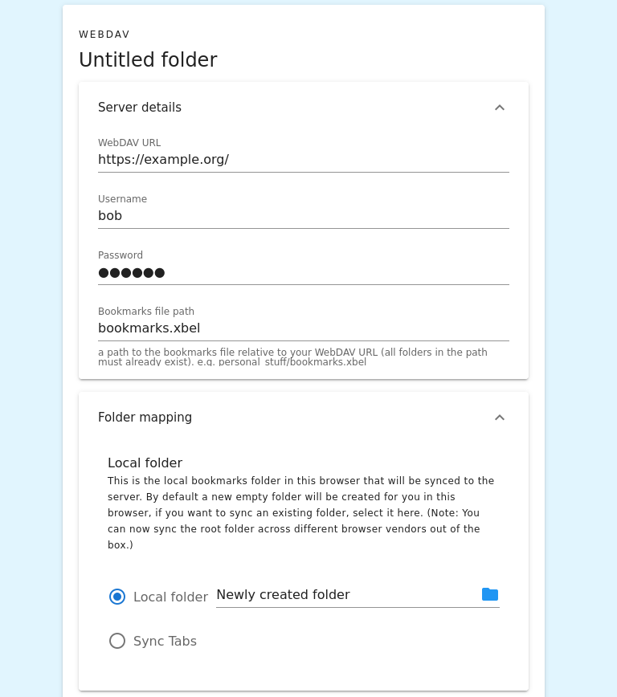

1. Create a new profile in the Floccus panel
2. Select XBEL in WebDAV as your sync method
3. The following screen shows the profile settings.
4. First you will need to enter your WebDAV URL. This should be the root URL of your WebDAV server, e.g. https://webdav.provider.com. The URL should end with a slash. Here’s [a list of the URLs for the most common public providers](https://community.cryptomator.org/t/webdav-urls-of-common-cloud-storage-services/75).
5. Then enter your username and password.
6. If you’d like to encrypt your data before storing it in your Drive, you can set a passphrase here. If you don’t enter anything, it won’t be encrypted.
7. Finally, you can choose which bookmarks folder to sync to that file. By default floccus will create a new folder for you, to avoid syncing something that you don’t want syned. However, with a click on the folder icon you can select any other folder in your bookmarks. It is not advised anymore to select the topmost folder, because the built-in bookmarks folders are named differently depending on browser vendor and language, and the original attempt to bridge this gap is no longer possible.
   
8. Make sure to disable your native browser bookmark sync service, because it is likely incompatible with floccus
